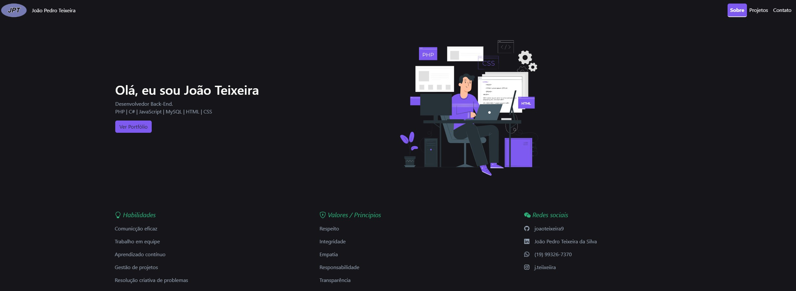

# Portifólio João Pedro Teixeira

## Línguagens e ferramentas utilizadas

## Objetivo

> Meu principal objetivo neste projeto foi **aprimorar minhas habilidades** técnicas e criativas, explorando linguagens e metodologias **front-end**. Busco constantemente desafios que me permitam expandir meu conhecimento e contribuir para projetos inovadores.

## Sobre o Projeto

Este portfólio foi desenvolvido como um espaço para mostrar meus projetos, habilidades e evolução como desenvolvedor front-end. A ideia é criar um site responsivo, moderno e funcional, utilizando tecnologias como HTML, CSS, JavaScript e Bootstrap. Além disso, serve como um reflexo do meu compromisso com o aprendizado contínuo e a busca por excelência técnica.

## Desafios e Aprendizados

Durante o desenvolvimento deste portfólio, enfrentei alguns desafios que me permitiram aprender e evoluir tanto tecnicamente quanto criativamente. Aqui estão os principais pontos:

### 1. **Design Limpo e Minimalista**
Um dos maiores desafios foi criar um design que fosse **limpo, organizado e fácil de navegar**. Para isso, precisei:
- **Priorizar a simplicidade:** Evitar elementos desnecessários que pudessem poluir visualmente o site.
- **Organizar o conteúdo:** Garantir que as informações estivessem bem distribuídas e fossem de fácil acesso.
- **Utilizar espaçamento adequado:** Aprendi a importância do **espaço em branco** para melhorar a legibilidade e a estética geral.

### 2. **Combinação de Cores**
Escolher uma paleta de cores que fosse **harmoniosa e profissional** foi outro desafio. Para isso:
- **Utilizei ferramentas:** Ferramentas como [Happyhues](https://www.happyhues.co/palettes/4) me ajudou a criar paletas que combinam bem.
- **Testei diferentes combinações:** Fiz vários testes para garantir que as cores escolhidas fossem agradáveis visualmente e transmitissem a mensagem certa.

### 3. **Responsividade e Adaptação**
Garantir que o site fosse **totalmente responsivo** foi um dos desafios técnicos mais importantes. Aprendi a:
- **Usar media queries:** Para ajustar o layout em diferentes tamanhos de tela.
- **Testar em dispositivos reais:** Verifiquei como o site se comportava em smartphones, tablets e desktops.
- **Priorizar a experiência do usuário:** Garantir que a navegação fosse intuitiva em qualquer dispositivo.

### 4. **Acessibilidade**
Outro aprendizado valioso foi a importância da **acessibilidade**. Para isso:
- **Utilizei contrastes adequados:** Garanti que o texto fosse legível em qualquer fundo.
- **Adicionei atributos alt em imagens:** Para melhorar a experiência de usuários que utilizam leitores de tela.
- **Testei o site com ferramentas de acessibilidade:** Para identificar e corrigir possíveis problemas.

## Links Úteis

- **Acesse o Portfólio Online:** [joaoteixeira9.github.io](https://joaoteixeira9.github.io/joaoteixeira9.io/)
- **LinkedIn:** [João Pedro Teixeira](https://www.linkedin.com/in/joaopedroteixeirain/)
- **Gmail:** [mentexdev@gmail.com](mailto:mentexdev@gmail.com)